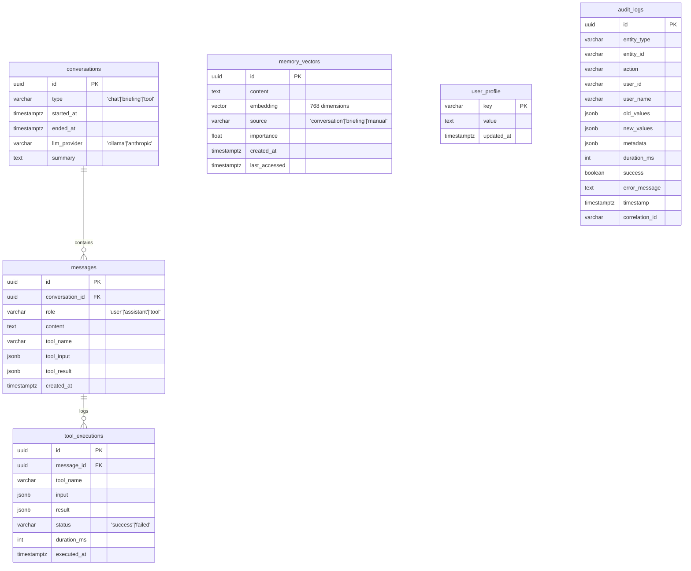

# ORION - Architecture des Données

## Diagramme Entité-Relation (ERD)

---

## Description des Tables

### conversations
Stocke les sessions de conversation avec ORION.

| Champ | Type | Description |
|-------|------|-------------|
| id | UUID | Clé primaire |
| type | VARCHAR | Type: 'chat', 'briefing', 'tool' |
| started_at | TIMESTAMPTZ | Début de la session |
| ended_at | TIMESTAMPTZ | Fin de session (nullable) |
| llm_provider | VARCHAR | 'ollama' ou 'anthropic' |
| summary | TEXT | Résumé auto généré |

### messages
Messages individuels dans une conversation.

| Champ | Type | Description |
|-------|------|-------------|
| id | UUID | Clé primaire |
| conversation_id | UUID | FK vers conversations |
| role | VARCHAR | 'user', 'assistant', 'tool' |
| content | TEXT | Contenu du message |
| tool_name | VARCHAR | Nom du tool (si role='tool') |
| tool_input | JSONB | Paramètres du tool |
| tool_result | JSONB | Résultat du tool |
| created_at | TIMESTAMPTZ | Timestamp |

### memory_vectors
Mémoire long-terme avec embeddings vectoriels (pgvector).

| Champ | Type | Description |
|-------|------|-------------|
| id | UUID | Clé primaire |
| content | TEXT | Texte mémorisé |
| embedding | vector(768) | Vecteur sémantique |
| source | VARCHAR | Origine: 'conversation', 'briefing', 'manual' |
| importance | FLOAT | Score 0.0 à 1.0 |
| created_at | TIMESTAMPTZ | Création |
| last_accessed | TIMESTAMPTZ | Dernier accès |

### user_profile
Profil utilisateur clé-valeur.

| Champ | Type | Description |
|-------|------|-------------|
| key | VARCHAR | Clé primaire (ex: 'name') |
| value | TEXT | Valeur |
| updated_at | TIMESTAMPTZ | Dernière modification |

### tool_executions
Log des exécutions de tools.

| Champ | Type | Description |
|-------|------|-------------|
| id | UUID | Clé primaire |
| message_id | UUID | FK vers messages |
| tool_name | VARCHAR | Nom du tool |
| input | JSONB | Entrée |
| result | JSONB | Résultat |
| status | VARCHAR | 'success' ou 'failed' |
| duration_ms | INT | Durée en ms |
| executed_at | TIMESTAMPTZ | Timestamp |

### audit_logs
Log d'audit pour traçabilité complète.

| Champ | Type | Description |
|-------|------|-------------|
| id | UUID | Clé primaire |
| entity_type | VARCHAR | Type d'entité concernée |
| entity_id | VARCHAR | ID de l'entité |
| action | VARCHAR | Action effectuée |
| user_id | VARCHAR | ID utilisateur |
| user_name | VARCHAR | Nom utilisateur |
| old_values | JSONB | Valeurs avant modification |
| new_values | JSONB | Valeurs après modification |
| metadata | JSONB | Métadonnées (IP, UserAgent, etc.) |
| duration_ms | INT | Durée de l'opération |
| success | BOOLEAN | Succès ou échec |
| error_message | TEXT | Message d'erreur si échec |
| timestamp | TIMESTAMPTZ | Date/heure de l'action |
| correlation_id | VARCHAR | ID de corrélation pour lier les actions |

**Index sur audit_logs :**
- `idx_audit_logs_timestamp` - Recherche par date
- `idx_audit_logs_entity` - Recherche par entité
- `idx_audit_logs_user` - Recherche par utilisateur
- `idx_audit_logs_action` - Recherche par action
- `idx_audit_logs_correlation` - Recherche par corrélation

---

## Schéma SQL

Voir [memory/schema.sql](../memory/schema.sql) pour le script complet.

Points clés :
- Extension `pgvector` pour les embeddings
- Index HNSW pour la recherche sémantique rapide
- RLS (Row Level Security) activé sur toutes les tables
- Clés étrangères avec `ON DELETE CASCADE`
- Table `audit_logs` avec 5 indexes pour traçabilité complète
