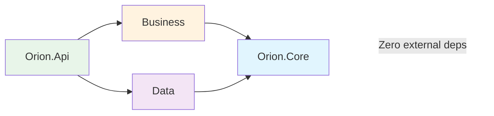

# ORION - Architecture des Classes

## Diagramme de Classes - Architecture en Couches

```mermaid
classDiagram
    direction TB

    namespace Core {
        class Conversation {
            +Guid Id
            +ConversationType Type
            +DateTime StartedAt
            +DateTime? EndedAt
            +LLMProvider? LlmProvider
            +string? Summary
            +ICollection~Message~ Messages
        }
        
        class Message {
            +Guid Id
            +Guid ConversationId
            +MessageRole Role
            +string Content
            +string? ToolName
            +string? ToolInput
            +string? ToolResult
            +DateTime CreatedAt
        }
        
        class AuditLog {
            +Guid Id
            +string EntityType
            +string EntityId
            +string Action
            +string? UserId
            +string? UserName
            +string? OldValues
            +string? NewValues
            +string? Metadata
            +TimeSpan? Duration
            +bool Success
            +string? ErrorMessage
            +DateTime Timestamp
            +string? CorrelationId
        }
        
        class MemoryVector {
            +Guid Id
            +string Content
            +float[] Embedding
            +string? Source
            +float Importance
            +DateTime CreatedAt
            +DateTime? LastAccessed
        }
        
        class ApiResponse~T~ {
            +bool Success
            +T? Data
            +string? Message
            +int StatusCode
            +Dictionary~string,string[]~? Errors
            +SuccessResponse(data)
            +ErrorResponse(message, statusCode)
        }
        
        class ILLMClient {
            <<interface>>
            +CompleteAsync(request)
            +StreamAsync(request, onChunk)
            +IsAvailable()
            +LLMProvider Provider
        }
        
        class IUnitOfWork {
            <<interface>>
            +IConversationRepository Conversations
            +IMessageRepository Messages
            +IMemoryRepository Memory
            +IUserProfileRepository UserProfile
            +IAuditLogRepository AuditLogs
            +SaveChangesAsync()
            +BeginTransactionAsync()
            +CommitTransactionAsync()
        }
        
        class IChatService {
            <<interface>>
            +SendMessageAsync(request)
            +GetConversationAsync(sessionId)
            +GetConversationsAsync(page, pageSize)
        }
        
        class ILLMService {
            <<interface>>
            +CompleteAsync(request)
            +CompleteWithPromptAsync(systemPrompt, userMessage)
            +StreamAsync(request, onChunk)
            +GetActiveProvider()
        }
    }

    namespace Data {
        class OrionDbContext {
            +DbSet~Conversation~ Conversations
            +DbSet~Message~ Messages
            +DbSet~MemoryVector~ MemoryVectors
            +DbSet~UserProfile~ UserProfiles
            +DbSet~AuditLog~ AuditLogs
        }
        
        class GenericRepository~T,TId~ {
            -OrionDbContext _context
            -DbSet~T~ _dbSet
            +AddAsync(entity)
            +GetByIdAsync(id)
            +FindAsync(predicate)
            +SaveChangesAsync()
        }
        
        class UnitOfWork {
            -OrionDbContext _context
            -IDbContextTransaction? _currentTransaction
            +Conversations
            +Messages
            +Memory
            +UserProfile
            +AuditLogs
            +ExecuteInTransactionAsync(action)
        }
    }

    namespace Business {
        class OllamaClient {
            -HttpClient _httpClient
            -ILogger~OllamaClient~ _logger
            -OllamaOptions _options
            +CompleteAsync()
            +StreamAsync()
        }
        
        class LLMRouter {
            -ILLMClient _ollamaClient
            -ILLMClient _anthropicClient
            -ILogger~LLMRouter~ _logger
            +CompleteAsync()
            +ActiveProvider
        }
        
        class ConversationAgent {
            -ILLMRouter _llmRouter
            -IUnitOfWork _unitOfWork
            -ILogger~ConversationAgent~ _logger
            +ProcessAsync(request)
        }
        
        class ChatService {
            -IConversationAgent _conversationAgent
            -IUnitOfWork _unitOfWork
            -ILogger~ChatService~ _logger
            +SendMessageAsync(request)
            +GetConversationAsync(sessionId)
            +GetConversationsAsync(page, pageSize)
        }
        
        class LLMService {
            -ILLMRouter _llmRouter
            -ILogger~LLMService~ _logger
            +CompleteAsync(request)
            +CompleteWithPromptAsync(systemPrompt, userMessage)
            +StreamAsync(request, onChunk)
            +GetActiveProvider()
        }
        
        class MemoryService {
            -IUnitOfWork _unitOfWork
            -ILogger~MemoryService~ _logger
            +SearchSimilarAsync(query, topK)
            +SaveMemoryAsync(content, source, importance)
            +GetUserProfileAsync()
        }
        
        class AuditService {
            -IUnitOfWork _unitOfWork
            -ILogger~AuditService~ _logger
            +LogAsync(entityType, entityId, action)
            +LogEntityCreateAsync(entity)
            +LogEntityUpdateAsync(oldEntity, newEntity)
            +LogEntityDeleteAsync(entity)
            +LogToolCallAsync(toolName, input, output)
            +LogLLMCallAsync(provider, model, prompt)
            +GetCorrelationId()
        }
    }

    namespace API {
        class ChatController {
            -IChatService _chatService
            +Chat(request)
            +GetConversation(sessionId)
            +GetConversations(page, pageSize)
        }
        
        class HealthController {
            -ILLMService _llmService
            +GetHealth()
        }
    }

    %% Relations
    Conversation "1" --> "*" Message : contains
    
    OrionDbContext ..> Conversation : manages
    OrionDbContext ..> Message : manages
    OrionDbContext ..> MemoryVector : manages
    
    GenericRepository ..|> IGenericRepository
    UnitOfWork ..|> IUnitOfWork
    
    OllamaClient ..|> ILLMClient
    LLMRouter ..|> ILLMRouter
    ConversationAgent ..|> IConversationAgent
    ChatService ..|> IChatService
    LLMService ..|> ILLMService
    
    ChatController ..> IChatService
    HealthController ..> ILLMService
    ChatService ..> IConversationAgent
    LLMService ..> ILLMRouter
    
    UnitOfWork --> OrionDbContext : uses
    GenericRepository --> OrionDbContext : uses
    ConversationAgent --> IUnitOfWork : uses
    ConversationAgent --> ILLMRouter : uses
```



---

## Règles d'Implémentation

### Couche Core
- **Zero dépendances externes**
- Interfaces, Entities, DTOs, Enums
- DTOs internes dans `DTOs/Internal/`

### Couche Data
- Implémente les interfaces Core
- EF Core + Npgsql + pgvector
- Repository Pattern + UnitOfWork

### Couche Business
- Implémente les interfaces Core
- Dépend de Core uniquement
- **Services** : exposés à l'API
- **Agents** : logique interne utilisée par les Services

### Couche API
- Controllers injectent uniquement des **Services**
- Jamais d'Agents directement dans les Controllers
- Middleware pour erreurs globales

---

## DTOs Internes vs Publics

### DTOs Internes (Business only)
```
Core/DTOs/Internal/LLM/
├── OllamaResponse.cs
└── AnthropicResponse.cs
```

Utilisés uniquement par :
- `OllamaClient`
- `AnthropicClient`

### DTOs Publics (API)
```
Core/DTOs/Requests/
├── ChatRequest.cs
└── LLMRequest.cs

Core/DTOs/Responses/
├── ApiResponse.cs
├── ChatResponse.cs
└── LLMResponse.cs
```

Utilisés par :
- Controllers (entrée/sortie)
- Services (méthodes publiques)

---

## Dépendances entre Projets



| Projet | Dépendances |
|--------|-------------|
| **Core** | Aucune (POCO, interfaces) |
| **Data** | Core + EF Core + Npgsql |
| **Business** | Core + HttpClient |
| **Api** | Core + Business + Data |
