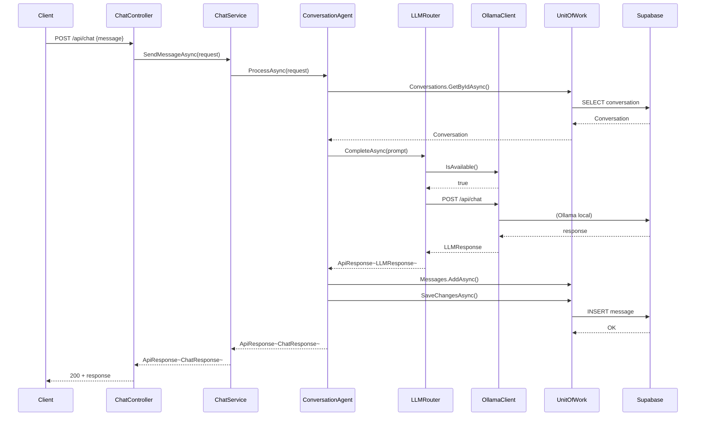
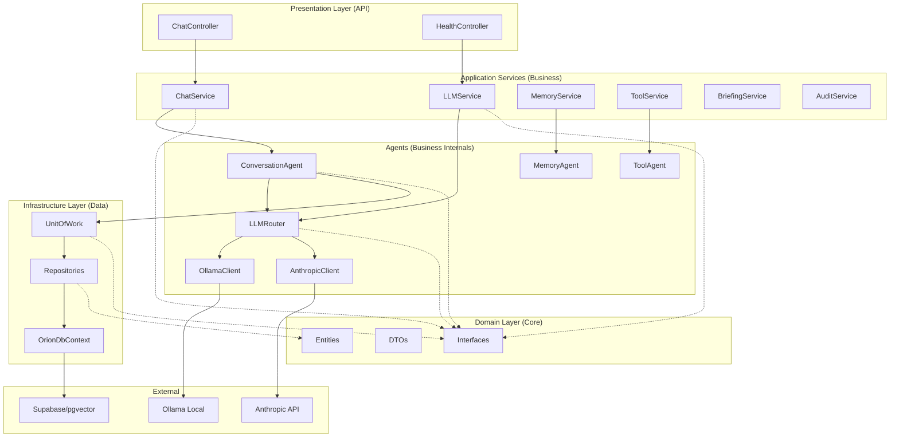

# ORION - Flux et Séquences

## Diagramme de Séquence - Requête Chat



---

## Architecture Hexagonale (Ports & Adapters)



### Flux de données

1. **Controller** reçoit la requête HTTP
2. **Service** orchestre la logique métier
3. **Agent** exécute la logique spécifique (LLM, mémoire, tools)
4. **Repository** persiste les données
5. **External** (Ollama/Anthropic/Supabase) fournit les ressources

---

## Pattern de Retour par Couche

```
┌─────────────────────────────────────────────────────────┐
│  Couche          │  Type de retour     │  Exemple      │
├─────────────────────────────────────────────────────────┤
│  Data            │  T? / IEnumerable   │  Conversation  │
│  Business        │  ApiResponse<T>     │  ApiResponse   │
│  API (Controller)│  IActionResult      │  StatusCode()  │
└─────────────────────────────────────────────────────────┘
```

### Exemple

**Business (Service)**
```csharp
public async Task<ApiResponse<ChatResponse>> SendMessageAsync(ChatRequest request)
{
    var conv = await _unitOfWork.Conversations.GetByIdAsync(request.SessionId);
    if (conv is null)
        return ApiResponse<ChatResponse>.NotFoundResponse("Session introuvable");
    
    // ... process ...
    
    return ApiResponse<ChatResponse>.SuccessResponse(new ChatResponse { ... });
}
```

**Controller**
```csharp
[HttpPost]
public async Task<IActionResult> Chat([FromBody] ChatRequest request)
{
    var response = await _chatService.SendMessageAsync(request);
    return StatusCode(response.StatusCode, response);  // Unwrap uniquement
}
```

---

## ToolResult vs ApiResponse

| Aspect | ToolResult | ApiResponse<T> |
|--------|-----------|----------------|
| **Couche** | Business (interne) | API (externe) |
| **Usage** | Retour d'un tool exécuté | Réponse HTTP au client |
| **Contenu** | Success, Data, Error, Metadata | Success, Data, Message, StatusCode, Errors |
| **HTTP Status** | Non concerné | 200, 201, 400, 404, 500... |
| **Client** | Services internes | Frontend/Postman |

### Pattern de propagation

```
Tool (Business) 
  → ToolResult (internal)
    → ToolService (wraps in ApiResponse)
      → ChatService
        → ChatController (unwraps to IActionResult)
```

### Exemple ToolResult enrichi

```csharp
public class ToolResult
{
    public bool Success { get; set; }
    public object? Data { get; set; }
    public string? Error { get; set; }
    public string? ErrorCode { get; set; }
    
    // Execution metadata
    public string? ToolName { get; set; }
    public TimeSpan? Duration { get; set; }
    public DateTime ExecutedAt { get; set; }
    public int? RetryCount { get; set; }
    
    // Source tracking
    public string? Source { get; set; }
    public Dictionary<string, object>? Metadata { get; set; }
}
```

---

## Structure des Fichiers

### Core - DTOs

```
Orion.Core/
├── DTOs/
│   ├── Internal/           ← DTOs Business uniquement
│   │   └── LLM/
│   │       ├── OllamaResponse.cs
│   │       └── AnthropicResponse.cs
│   ├── Requests/           ← Entrées API
│   │   ├── ChatRequest.cs
│   │   └── LLMRequest.cs
│   └── Responses/          ← Sorties API
│       ├── ApiResponse.cs
│       └── ChatResponse.cs
```

### Business - Services & Agents

```
Orion.Business/
├── Services/              ← Interface avec API
│   ├── ChatService.cs
│   ├── LLMService.cs
│   └── MemoryService.cs
├── Agents/                ← Logique interne
│   ├── ConversationAgent.cs
│   ├── MemoryAgent.cs
│   └── ToolAgent.cs
└── LLM/
    ├── OllamaClient.cs
    └── AnthropicClient.cs
```

### API - Controllers

```
Orion.Api/
├── Controllers/           ← Uniquement Services ici
│   ├── ChatController.cs  (IChatService)
│   └── HealthController.cs (ILLMService)
└── Middleware/
    └── ErrorHandlingMiddleware.cs
```

---

## Règles de Code

1. **Controllers** → injectent uniquement des **Services**
2. **Services** → orchestrent les **Agents** et **Repositories**
3. **Agents** → logique métier spécifique (LLM, mémoire, tools)
4. **Clients LLM** → communiquent avec Ollama/Anthropic
5. **Repositories** → accès données via EF Core

### Anti-patterns à éviter

❌ Controller → Agent (toujours passer par un Service)
❌ Service → Repository direct (utiliser UnitOfWork)
❌ Classes privées dans les fichiers (utiliser DTOs dans Core/Internal)
